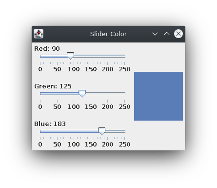
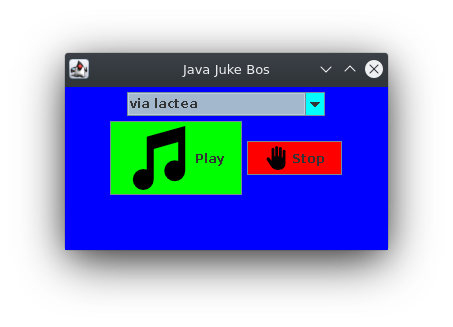

# GUI Elements
At least three kinds object are needed to create a GUI in java:
* Components
* Events
* Listeners

It's fundamentals for creating an interfez graphigs in Java.
A GUI is made up of components, events that represent user **action**, and listeners that **respond** to those events.
Other concept importanting is **layout manager**  which manager posicion of component of our interfaz, a containiner us governed by layout manager.

## Step for creating an interfaz 
It creates and  sets  up  the  GUI  components,  creates  the  appropriate  listener  for  the  event  of  interest,  and  sets  up  the  relationship  between  the  listener  and  the  component  that  will  generate  the event.

### Key concepts
* layout manager
* action event
* listener object
* listener update our components

## GUI 

### [Push Counter](./1PushCounter/) - Frame y Panel

### [Left Right](./2LeftRight/) - Buttons y Labels

### [Farenheit Converter](./3Farenheit/) - TextField 

### [Style Options](./4StyleOptions/) - Checkbox

### [Quote Options](./5QuoteOptions/) - Radio buttons

### [Slider Color](./6SliderColor/) - Slider

### [JukeBox](./7JukeBox/) - ComboBox 

